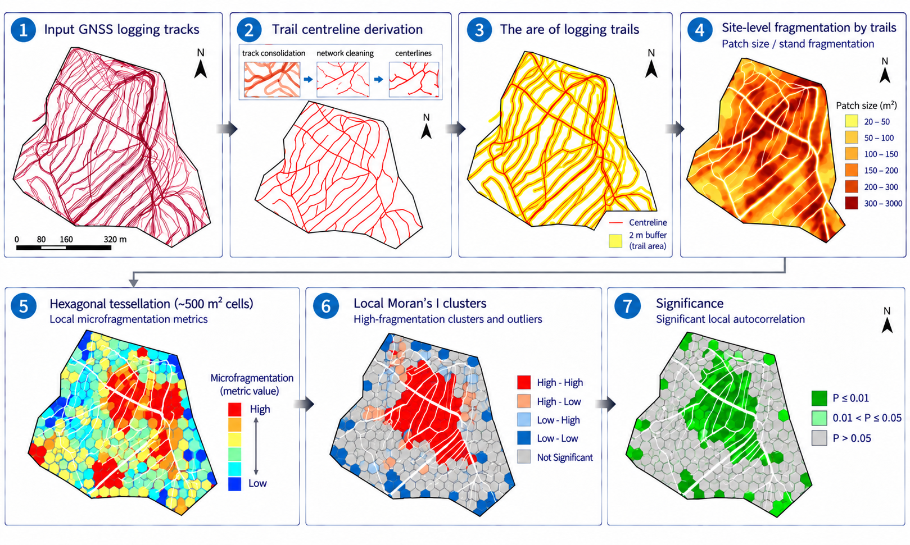

# Forest Trail Network Analysis

Tools and example data for analysing forest machine trail networks and their spatial effects on forest sites.

## Overview

This repository contains code and example spatial data for a workflow used to analyse forest machine trail networks.

The workflow combines GNSS-based trail data processing, GIS-derived spatial layers, and R-based calculation of trail-network and landscape-fragmentation metrics.

The complete study included 15 sites. This repository provides anonymized example spatial data for Sites 2 and 4 to demonstrate the data structure and site-level analysis workflow. The complete research dataset is not distributed in this repository.

## Analysis workflow



The workflow progresses from GNSS logging tracks through trail-centreline derivation and trail-area delineation to site- and cell-level fragmentation analysis.

## GNSS track consolidation

The trail centrelines used in this analysis were derived from GNSS logging tracks using the **GNSS-Track-Consolidation** workflow.

The consolidation workflow is maintained as a separate open GitHub repository:

**[GNSS-Track-Consolidation](https://github.com/OMID018/GNSS-Track-Consolidation)**

In the workflow shown above, this external processing step corresponds to the transition from **1. Input GNSS logging tracks** to **2. Trail centreline derivation**.

The resulting trail centrelines are subsequently used for the spatial and fragmentation analyses in this repository.

## Repository structure

- `R/` — R scripts for calculating site-level and cell-level metrics and for subsequent analysis.
- `data/` — documentation and anonymized example spatial data.
- `data/example/site02/` — example spatial layers for Site 2.
- `data/example/site04/` — example spatial layers for Site 4.
- `docs/` — figures and documentation, including the analysis workflow figure.
- `results/` — outputs generated by the R analysis scripts.

The GNSS track-consolidation code is maintained separately in the [GNSS-Track-Consolidation](https://github.com/OMID018/GNSS-Track-Consolidation) repository and is therefore not duplicated here.

## Analysis workflow

The general workflow is:

1. GNSS field tracks are collected.
2. GNSS tracks are consolidated into a trail-network representation.
3. GIS processing is used to derive site boundaries, trail centrelines, and spatial patches.
4. R scripts calculate trail-network and landscape-fragmentation metrics.
5. The resulting metrics are used for statistical analysis and visualization.

## R scripts

### `01_site_metrics.R`

Calculates site-level metrics from the example spatial data, including patch metrics, trail density, sinuosity, and trail-network junction metrics.

The script automatically detects compatible sites stored under `data/example/`.

### `02_cell_metrics.R`

Calculates metrics at the tessellation-cell level.

This analysis requires additional tessellation-derived spatial layers (`Tessellation`, `T_Centreline`, and `Cell_Patches`) that are not currently included in the public example dataset.

### `03_analysis.R`

Contains the subsequent analysis and visualization workflow.

The full statistical analysis was developed for the complete study dataset. The public example data are intended primarily to demonstrate the spatial-data structure and metric-calculation workflow.

## Example data

Anonymized example shapefiles for Sites 2 and 4 are available under `data/example/`.

The spatial data use **ETRS89 / UTM zone 35N (EPSG:25835)**.

See `data/README.md` for a description of the example datasets and spatial layers.

## Software

The R workflow uses the following packages:

- `sf`
- `dplyr`
- `tidyverse`
- `ggplot2`
- `flextable`
- `officer`

## Reproducibility

Run the R scripts from the root directory of the repository.

The example site-level workflow can be run using:

```r
source("R/01_site_metrics.R")
